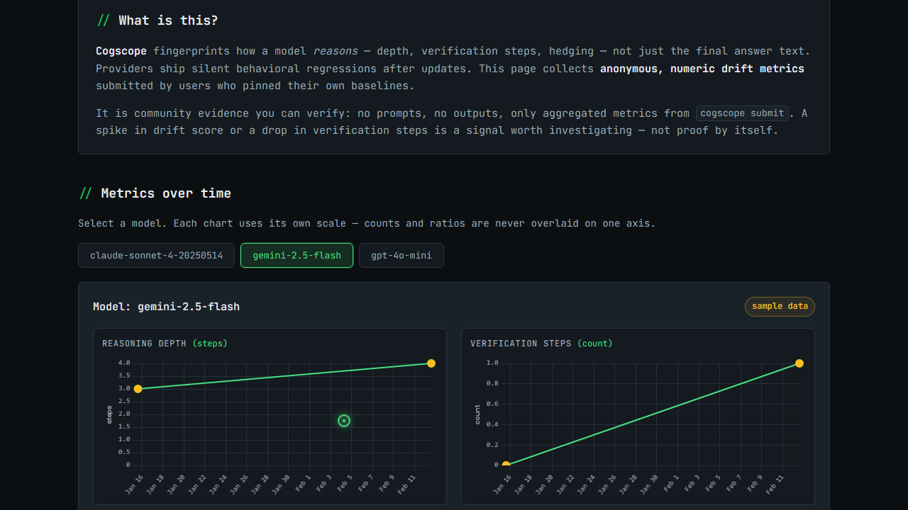

<p align="center">
  
</p>

# Cogscope

[](https://github.com/aadi-joshi/cogscope/actions)
[](pyproject.toml)
[](LICENSE)

Created by [**Kavya Bhand**](https://github.com/kavyabhand) and [**Aadi Joshi**](https://github.com/aadi-joshi).


**Cogscope is a local reverse proxy that fingerprints reasoning shape on every LLM call, stores a per-session trajectory, and flags statistically corroborated drift from a baseline you pin.** Live alerts combine KSWIN and MDDM streaming tests on heuristic metrics; batch checks use Mann-Whitney U with Benjamini-Hochberg FDR and a Cauchy Combination Test (CCT) omnibus; CI regression suites use McNemar's exact test or paired permutation tests.

```bash
pipx install cogscope
cogscope quickstart
```

`quickstart` runs a mock scenario with no API keys. Under 30 seconds.

---

## The problem

On long autonomous agent runs, per-turn output can stay fluent while **verification-step variance collapses**: the count and pattern of self-check language stops varying across turns even though answers remain long. That is measurable (rolling variance of `verification_steps` and related fingerprint metrics) and distinct from a single bad response.

Single-response evals score fixed prompts. Production observability aggregates latency, tokens, and traces. Neither tracks whether *your* agent's reasoning trajectory stayed healthy across hundreds of proxied turns on your machine. Cogscope sits in the request path, fingerprints each completed response without delaying the stream, and compares new fingerprints to a baseline you pinned, including session stability warnings when verification variance flattens.

---

## Measured, not asserted

Synthetic benchmarks from the drift engine (250 trials at alpha=0.05 unless noted):

| Scenario | Method | False positive rate |
|----------|--------|-------------------|
| Correlated stationary series, no drift | Legacy Fisher omnibus | 0.024 (6/250) |
| Correlated stationary series, no drift | CCT batch (current) | 0.024 (6/250) |
| Independent stationary series, no drift | Legacy (>=2 metrics) | 0.016 (4/250) |
| Independent stationary series, no drift | CCT batch (current) | 0.032 (8/250) |
| Streaming stable series (150 steps) | KSWIN / MDDM (current) | 0.000 (0/150) |
| Streaming stable series (150 steps) | Legacy ADWIN / Page-Hinkley | 0.000 (0/150) |

Shift detection on synthetic streaming data: injected shift at step 80, first KSWIN/MDDM alert at step 87. Paired shift tests on benchmark suites: McNemar exact p≈0.000002; paired permutation p=0.0002.

Session collapse rule (synthetic): healthy 30-turn session, no warning; collapsing verification variance triggers warning at turn 22 (9-turn delay after collapse onset).

These numbers justify the specific tests in use. They do not certify behavior on your production traffic; pin a baseline and treat alerts as signals to investigate.

---

## How this compares

| | Output-quality eval tools | Enterprise observability (Langfuse, LangSmith, Arize, …) | Local agent firewalls (cost/security) | Cogscope |
|---|---------------------------|----------------------------------------------------------|---------------------------------------|----------|
| **Persona** | Benchmark authors, QA | ML platform teams, cloud dashboards | Developers running autonomous agents | Developers running long unattended agent sessions |
| **What they measure** | Final answers on fixed prompts | Latency, tokens, traces, costs, post-hoc analysis | Spend limits, secrets, policy blocks | Reasoning-shape metrics and session trajectories on *your* traffic |
| **Baseline** | Global benchmarks | Fleet aggregates | Static rules | *Your* pinned fingerprint |
| **Typical blind spot** | Shallow reasoning when answers still read well | Local per-session reasoning health | Reasoning-shape drift over a run | Semantic correctness and cheat-proof attestation |

These approaches are complementary. Cogscope targets unattended runs where each turn looks fine but verification behavior stops varying across the session.

---

## Install

**Recommended** (isolated CLI on your PATH):

```bash
pipx install cogscope
cogscope quickstart
```

Requires [pipx](https://pipx.pypa.io/) and Python 3.10+.

**Alternatives:**

```bash
pip install cogscope

# Standalone binary (no Python install): GitHub Releases
# https://github.com/aadi-joshi/cogscope/releases
```

Initialize a project directory (creates `.cogscope/` and a local DuckDB store):

```bash
cogscope init --yes
```

No Docker required for normal use. See [Installation](docs/getting-started/installation.md) for optional container deployment.

---

## Recommended: wrap your agent (zero code changes)

```bash
cogscope wrap -- aider
cogscope wrap -- claude
cogscope wrap -- python my_agent.py
```

`wrap` starts the proxy if needed, injects `OPENAI_BASE_URL`, `OPENAI_API_BASE`, and `ANTHROPIC_BASE_URL` so OpenAI- and Anthropic-compatible SDKs route through `http://127.0.0.1:8642`. Set provider API keys in the environment as usual.

Live dashboard in a second terminal:

```bash
cogscope watch
```

Session-scoped tracking:

```bash
cogscope wrap --session-id my-long-run -- aider
```

See [Proxy and Privacy](docs/guides/proxy-and-privacy.md) and [Session trajectories](docs/concepts/sessions.md).

---

## How it works

Cogscope forwards provider traffic unchanged, fingerprints each completed response on the side, and compares new fingerprints to a baseline you pin.

```
  Your agent         Cogscope proxy          Provider API
      │                    │                       │
      │  chat request      │  forward (same body)  │
      ├───────────────────►├──────────────────────►│
      │                    │                       │
      │  streamed response │◄──────────────────────┤
      ◄────────────────────┤                       │
      │                    │                       │
      │                    ├── capture trace       │
      │                    ├── fingerprint metrics │
      │                    ├── session trajectory  │
      │                    ├── diff vs baseline    │
      │                    └── alert if outlier    │
```

| Step | What happens |
|------|----------------|
| **Capture** | Every proxied call becomes a `ReasoningTrace` (prompt, output, reasoning text, tokens). |
| **Fingerprint** | Heuristic metrics: reasoning depth, verification steps, hedging ratio, corrections, and more. |
| **Session track** | Each turn is tagged with `session_id` and turn number; collapse detection watches verification variance over time. |
| **Pin** | `cogscope pin --label baseline` saves "normal" for a task/model pair. |
| **Diff** | Live traffic is compared to that baseline. Alerts require corroborated statistical outliers, not a single short answer. |

### Detection methods by path

| Path / command | When to use | Statistical method | Alert rule (summary) |
|----------------|-------------|--------------------|----------------------|
| Live proxy (`watch`, `wrap`) | Streaming traffic during a session | KSWIN + MDDM per metric ([frouros](https://github.com/IFCA/frouros)) | >=2 metric streams flag structural drift; length-only shifts do not alert alone |
| Session trajectories | Long runs with `--session-id` | Rolling verification variance collapse | Distinct session stability warning after 20+ turns |
| Batch diff (`diff`, population `check`) | Comparing capture sets vs baseline | Mann-Whitney U per metric, Benjamini-Hochberg FDR, Cauchy Combination Test | Omnibus structural drift call on correlated metrics |
| CI regression (`regression`) | Fixed benchmark suite with oracle | McNemar exact (binary) or paired permutation (continuous) | Pass/fail on suite shift vs pinned baseline |
| Optional `watch --semantic` | Embedding-based shape change | Jensen-Shannon on local sentence-transformer embeddings | Semantic drift (`pip install cogscope[semantic]`) |
| Optional `watch --otel` | Export to your observability stack | OTel GenAI spans + `cogscope.fingerprint.*` attrs | OTLP export (`pip install cogscope[otel]`) |

**Structural vs semantic drift:** Heuristic fingerprint shifts are *structural drift* (reasoning shape changed, often provider tuning). Embedding shifts are *semantic drift*. Neither alone proves the model got worse.

### Day-to-day commands

```bash
cogscope wrap -- aider
cogscope watch
cogscope pin --label baseline
cogscope report --session my-long-run
cogscope diff --baseline baseline
cogscope check -c examples/contracts/basic_reasoning.yaml "Your prompt here"
```

Set `OPENAI_API_KEY`, `ANTHROPIC_API_KEY`, or `GOOGLE_API_KEY` before `wrap` or `watch`. Keys stay in memory for forwarding only and are never written to the local database.

---

## Public drift tracker

The [Cogscope Drift Tracker](https://aadi-joshi.github.io/cogscope/) is a static site of opt-in, anonymous fingerprint trends (depth, verification, hedging, drift vs each submitter's baseline). No prompts or outputs are published.



[Animated demo (GIF)](docs/assets/tracker-demo.gif) · [Full demo (MP4)](docs/assets/tracker-demo.mp4) · [Contribute data](docs/guides/public-drift-log.md)

Regenerate recordings: `python scripts/demo/record_tracker.py` (see `scripts/demo/README.md`).

---

## Terminal quickstart recording (optional)

Animated terminal capture of `cogscope quickstart` ([VHS](https://github.com/charmbracelet/vhs)):

[View quickstart.gif](docs/assets/quickstart.gif)

Regenerate: `vhs scripts/demo/quickstart.tape` (see `scripts/demo/README.md`).

---

## What this is NOT

- **Not a universal intelligence score.** Metrics are relative to *your* pinned baseline for *your* task, not a leaderboard across models.
- **Not proof of provider wrongdoing.** Cogscope shows statistical deviation from behavior you recorded. It does not adjudicate intent or fault.
- **Not cheat-proof.** Someone optimizing specifically against these heuristics can game them. Treat alerts as signals to investigate, not verdicts.
- **Not alarmed by efficiency alone.** A model that becomes more concise **without** losing verification depth or other quality signals should **not** trigger a drift alert. Alerting requires corroborated, multi-metric outliers relative to your baseline distribution (see `cogscope/drift/detector.py`).

---

## Limitations (read this)

Fingerprint metrics are **heuristic and regex-based**, not semantic understanding. They count patterns like "let me verify", step labels, and uncertainty markers. Those are useful proxies, not ground truth. A model can appear deep while reasoning poorly, or concise while still being rigorous. Calibration improves with more baseline history, but this will never replace human review for high-stakes decisions.

---

## Local-first, no cloud

Cogscope runs entirely on your machine. No account, no telemetry, no bill. Traces and fingerprints live in a local DuckDB file under `.cogscope/`. The proxy binds to `127.0.0.1` by default. The only data that leaves your machine is what you explicitly choose to send via `cogscope submit` after a preview-and-confirm step.

---

## Development

```bash
git clone https://github.com/aadi-joshi/cogscope.git
cd cogscope
pip install -e ".[dev]"
pytest
```

See [CONTRIBUTING.md](CONTRIBUTING.md) for setup, style, and how to add metrics or adapters.

---

## License

MIT. See [LICENSE](LICENSE).
