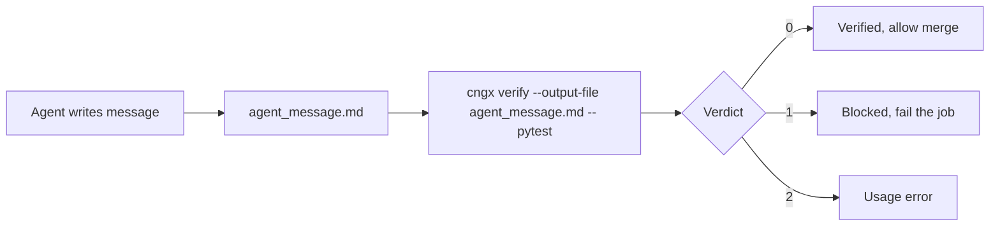

# Gate a coding agent in CI

Your AI coding agent says done, tests pass. `cngx verify` runs what it claimed and blocks the merge when it is not true.

Use this guide when an AI agent produces a merge-ready message ("fixed it, all tests pass, ready to merge") and you want CI to run the real checks and block the merge on a false claim. No API keys required.

For tool-specific copy-paste commands, see [Coding agent verification recipes](coding-agent-recipes.md).

## Flow



Plain steps:

1. Your agent finishes a task and writes its message to a file (for example `agent_message.md`).
2. `cngx verify` runs the real command after `--`, reads what the agent claimed, and compares the two.
3. Use the exit code in CI: 0 verified, 1 blocked, 2 usage error.

```bash
pipx install cngx

cngx verify --output-file agent_message.md -- pytest
```

cngx blocks (exit 1) when the agent claimed success but the tests fail, or when the agent's reported test counts do not match the real run. The verdict is bound to real command output, so a well-written summary cannot pass on its own.

Example BLOCKED output:

```
BLOCKED  Agent claimed the work is done, but verification failed.
  Agent said: "all tests pass", "ready to merge"
  Real result: FAILED (failures=2)
exit code: 1
```

## Where the claim and reality come from

The claim (what the agent said it did) comes from `--output-file FILE`, `--stdin`, or `--claim "text"`. Reality comes from a command after `--` (cngx runs it) or from `--evidence-file LOG` (an existing log, parsed without running).

Supported result parsers: pytest, unittest, jest/vitest, go test, cargo test, and a generic exit-code fallback.

## Useful flags

| Flag | Effect |
|------|--------|
| `--require-claim` | Also block if the checks pass but the agent made no verification claim |
| `--timeout SECONDS` | Kill the command after this many seconds (default 600) |
| `--json` | Machine-readable verdict for downstream steps |

## Offline: gate an existing CI log with `--evidence-file`

When the tests already ran in a prior CI step and you have the log on disk, verify the claim against that log instead of running the command again:

```bash
cngx verify --output-file agent_message.md --evidence-file pytest.log
```

cngx parses the log for a real result line (for example `N passed`, `N failed`) and blocks when the agent's claim contradicts it. Use either a command after `--` or `--evidence-file`, not both.

## GitHub Actions

Use the composite action. Set `command` to the real verification command and `output-file` to the agent's message:

```yaml
name: Agent gate

on:
  pull_request:

jobs:
  gate:
    runs-on: ubuntu-latest
    steps:
      - uses: actions/checkout@v4

      # Your agent writes its merge-ready message, for example:
      # - run: ./run-agent.sh > agent_message.md

      - uses: aadi-joshi/cngx@v0.2.0
        with:
          output-file: agent_message.md
          command: pytest -q
```

The job fails on a blocked verdict (exit 1). No provider secrets are required.

To gate a log from an earlier step instead of running the command, set `evidence-file` instead of `command`. See [GitHub Action](github-action.md) for all inputs.

## Advanced: `cngx check` is heuristic and gameable

`cngx check` scores the *text* of an agent's output against a YAML policy using regex heuristics (verification phrases, reasoning depth, and so on). It does not run anything. An agent that writes "I ran the tests, all 12 passed" without running anything can satisfy a text-only policy. Treat `check` as behavioral linting, not proof of execution.

For real proof that the checks pass, use `cngx verify`, which is bound to actual command output. See [CLI Reference](../cli/reference.md#check) for the `check` details if you still want the heuristic lint.

## Related

- [Coding agent verification recipes](coding-agent-recipes.md)
- [CLI `verify`](../cli/reference.md#verify)
- [GitHub Action](github-action.md)
- [Writing a Policy](../concepts/policies.md) (for the advanced `check` path)
