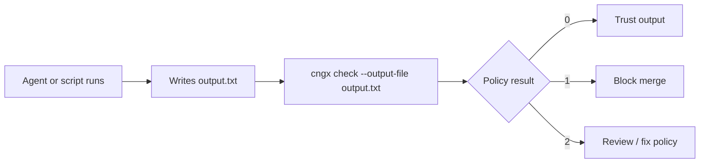

# Gate a coding agent in CI

cngx checks whether a coding agent actually ran the verification your policy requires before you trust its output.

Use this guide when your CI already has agent text on disk (patch summary, PR comment export, log file) and you want to block merge-ready output that skipped tests. No API keys required.

## Flow



Plain steps:

1. Your agent finishes a task and writes its response to a file (for example `output.txt`).
2. Run cngx against that file with a coding-agent policy.
3. Use the exit code in CI to pass, block, or review.

```bash
pipx install cngx
cngx init --yes

cngx check \
  -c examples/contracts/coding_agent_verification.yaml \
  -p "Fix the pagination bug and run tests before merge" \
  --output-file output.txt
```

Copy `examples/contracts/coding_agent_verification.yaml` into your repo, or start with `coding_agent_verification_lenient.yaml` for softer onboarding.

## Evidence file (optional)

Offline policies score the *text* of agent output. An agent that fabricates "12 passed" without running tests can still pass text-only checks. Pass `--evidence-file` with a real tool log so cngx also requires a concrete result line:

```bash
cngx check \
  -c examples/contracts/coding_agent_verification.yaml \
  -p "Fix the pagination bug and run tests before merge" \
  --output-file output.txt \
  --evidence-file pytest.log
```

The evidence file must look like real tool output (for example a pytest log containing `N passed`). Bad evidence still blocks immediately. When the log is valid, cngx appends the first matching result line into the text under policy review before fingerprinting, so a well-reasoned writeup that forgot to paste pytest output can still satisfy required result patterns. In GitHub Actions, set the `evidence-file` input. See [GitHub Action](github-action.md).

## Exit codes

| Code | Meaning | CI action |
|------|---------|-----------|
| `0` | Passed | Allow merge or continue pipeline |
| `1` | Blocked | Fail the job (hard policy violation) |
| `2` | Failed | Fail or review (soft violation or input error) |

## Try the fixtures

This repository ships sample agent output under `tests/fixtures/agent_outputs/`:

```bash
# Should block (exit 1): plausible patch, no test evidence
cngx check \
  -c examples/contracts/coding_agent_verification.yaml \
  -p "Fix pagination and run tests" \
  --output-file tests/fixtures/agent_outputs/unverified_patch.txt

# Should pass (exit 0): documents pytest run and verification steps
cngx check \
  -c examples/contracts/coding_agent_verification.yaml \
  -p "Fix pagination and run tests" \
  --output-file tests/fixtures/agent_outputs/verified_fix.txt
```

Run `cngx quickstart` for a zero-key demo of the same verification-collapse scenario.

## GitHub Actions

Use the composite action at the repository root. Set `output-file` to gate existing agent output with no provider calls:

```yaml
name: Agent gate

on:
  pull_request:

jobs:
  gate:
    runs-on: ubuntu-latest
    steps:
      - uses: actions/checkout@v4

      # Your agent writes merge-ready text, for example:
      # - run: ./run-agent.sh > agent_output.txt

      - name: cngx policy gate
        uses: aadi-joshi/cngx@v0.1.7
        with:
          policy: examples/contracts/coding_agent_verification.yaml
          prompt: "Fix the bug and run the test suite before merge"
          output-file: agent_output.txt
```

See [GitHub Action](github-action.md) for all inputs and [example-agent-gate.yml](https://github.com/aadi-joshi/cngx/blob/main/.github/workflows/example-agent-gate.yml) for a full dogfooding workflow.

## Offline vs live `cngx check`

| Mode | Command pattern | Calls a model? |
|------|-----------------|----------------|
| **Offline (CI gate)** | `--output-file path` or `--stdin` | No |
| **Live capture** | positional prompt + `--adapter mock` (or openai, etc.) | Yes |

Prompt-only `cngx check "..." -c policy.yaml` re-captures a response through an adapter. That is useful for demos and policy tuning, not for gating real agent output in CI. Use `--output-file` when the agent already produced the text you need to trust.

## Related

- [Writing a Policy](../concepts/policies.md)
- [CLI `check`](../cli/reference.md#check)
- [GitHub Action](github-action.md)
