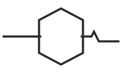

<p align="center">
  
</p>

# cngx

**Your AI coding agent says done, tests pass. cngx runs what it claimed and blocks the merge when it is not true.**

Local CLI and CI gate. No account. No cloud.

## What `cngx verify` does

```bash
cngx verify --output-file agent_message.md -- pytest
```

1. Runs the real command after `--` (anything, for example `pytest`, `npm test`, `go test ./...`).
2. Reads what the AI agent CLAIMED in its message ("all tests pass, ready to merge").
3. Parses the true result (passed/failed) from the command output.
4. BLOCKS (exit 1) when the agent claimed success but the checks actually fail, or when the agent's reported test counts do not match the real run.

The verdict is bound to real command output, so it cannot be gamed by prose.

Example BLOCKED output:

```
BLOCKED  Agent claimed the work is done, but verification failed.
  Agent said: "all tests pass", "ready to merge"
  Real result: FAILED (failures=2)
exit code: 1
```

The claim comes from `--output-file FILE`, `--stdin`, or `--claim "text"`. Reality comes from a command after `--` or from `--evidence-file LOG` (an existing log, parsed without running). Exit codes: 0 verified, 1 blocked, 2 usage error. Supported parsers: pytest, unittest, jest/vitest, go test, cargo test, and a generic exit-code fallback.

## Quick start

```bash
pipx install cngx
cngx quickstart
```

Or with pip inside a project environment: `pip install cngx && cngx quickstart`

Standalone binaries (no Python) are on [GitHub Releases](https://github.com/aadi-joshi/cngx/releases).

`quickstart` runs in about a second with no API keys. It builds a throwaway project with a real bug, runs the actual tests, and shows a false "all tests pass" claim blocked, then a real fix verified.

## In CI

```yaml
- uses: aadi-joshi/cngx@v0.2.0
  with:
    output-file: agent_message.md
    command: pytest -q
```

The job fails on a blocked verdict. No provider secrets required. See [Gate a coding agent](guides/gate-coding-agent.md) and the [GitHub Action](guides/github-action.md).

## Advanced features

These are not the headline. They exist for power users and are experimental.

- **`cngx check`** scores the *text* of agent output against a YAML policy using regex heuristics. It does not run anything, so a fabricated "all tests passed" claim can satisfy it. Use `cngx verify` for real proof; use `check` only as behavioral linting.
- **Drift engine** (`wrap` / `watch` / `pin` / `diff`) routes an OpenAI/Anthropic agent through a local proxy, fingerprints reasoning, and flags statistical drift over long sessions. See [Drift Detection](concepts/drift.md) and [Session trajectories](concepts/sessions.md).
- **Community tracker** (`cngx submit`) shares opt-in numeric metrics to a public drift log. The tracker currently has little to no community data; treat it as an early signal board, not a dataset.

Nothing requires a cloud account. Data stays on your machine unless you explicitly run `cngx submit`.

## Documentation map

| Section | What you'll learn |
|---------|-------------------|
| [Installation](getting-started/installation.md) | Install from PyPI or source |
| [Quickstart](getting-started/quickstart.md) | `cngx verify` in one command |
| [Gate a coding agent](guides/gate-coding-agent.md) | Block a false success claim in CI |
| [CLI Reference](cli/reference.md) | Every command, with `verify` first |
| [GitHub Action](guides/github-action.md) | The `command` input and CI examples |
| [Writing a Policy](concepts/policies.md) | YAML policy schema for the advanced `check` |
| [Drift Detection](concepts/drift.md) | Advanced: session drift alerts |
| [Session trajectories](concepts/sessions.md) | Advanced: multi-turn collapse detection |
| [Proxy & Privacy](guides/proxy-and-privacy.md) | What leaves your machine (nothing by default) |
| [Public Drift Log](guides/public-drift-log.md) | Community tracker and `cngx submit` |
| [FAQ](faq.md) | Honest answers to skeptical questions |
| [Roadmap](roadmap.md) | What's in v0.2.0 and what's deferred |

## License

MIT. See [LICENSE](https://github.com/aadi-joshi/cngx/blob/main/LICENSE) in the repository.
